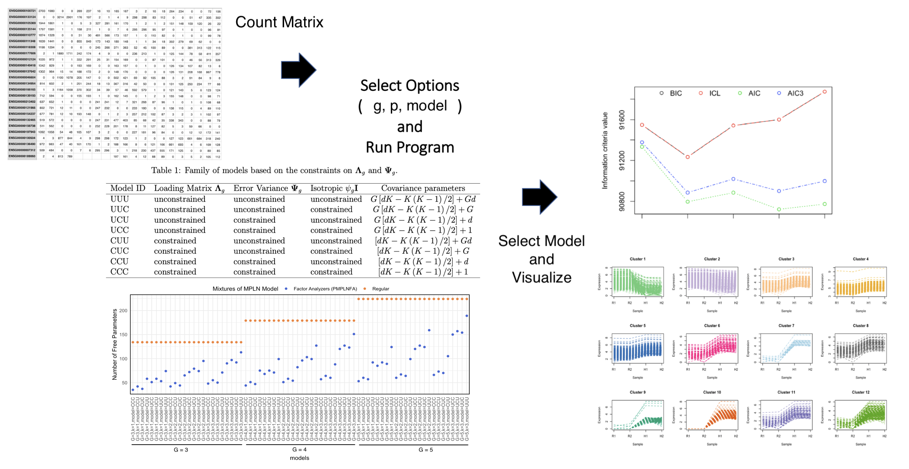

<!-- README.md is generated from README.Rmd. Please edit that file -->

```{r, include = FALSE}
knitr::opts_chunk$set(
  collapse = TRUE,
  comment = "#>",
  fig.path = "man/figures/README-",
  out.width = "100%"
)
```

# mixMPLNFA
Mixtures of Multivariate Poisson-Log Normal Factor Analyzers for Clustering Count Data

<!-- badges: start -->
[](https://github.com/anjalisilva/mixMPLNFA/issues)
[](./LICENSE)
 
 

<!-- badges: end -->

## Description
`mixMPLNFA` is an R package for performing clustering using parsimonious mixtures of multivariate Poisson-log normal factor analyzers family (MPLNFA) via variational Gaussian approximations. It was developed for count data, with clustering of RNA sequencing data as a motivation. However, the clustering method may be applied to other types of count data. The package provides functions for parameter estimation via a variational Gaussian approximation with Expectation-Maximization (EM) algorithm. Information criteria (AIC, BIC, AIC3 and ICL) utilized for model selection. 

## Installation

To install the latest version of the package:

``` r
require("devtools")
devtools::install_github("anjalisilva/mixMPLNFA", build_vignettes = TRUE)
library("mixMPLNFA")
```

To run the Shiny app (under construction):
``` r
mixMPLNFA::runMixMPLNFA()
```

## Overview

To list all functions available in the package: 

``` r
ls("package:mixMPLNFA")
```

`MPLNClust` contains 3 functions. 

1. __*MPLNFAClust*__ for carrying out clustering of count data using parsimonious mixtures of multivariate Poisson-log normal factor analyzers
2. __*mplnFAVisLine*__ for visualizing clustering results as line plots
3. __*runMixMPLNFA*__ is the shiny implementation of *MPLNFAClust* (under construction)

For more information, see details section below. An overview of the package is illustrated below:

<div style="text-align:center">



<div style="text-align:left">
<div style="text-align:left">
``` r
```

## Details 

Mixture model-based clustering methods can be over-parameterized in
high-dimensional spaces, especially as the number of clusters increases. Subspace clustering allows to cluster data in low-dimensional subspaces, while keeping all the dimensions and by introducing restrictions to mixture parameters ([Bouveyron and Brunet, 2014](https://www.sciencedirect.com/science/article/abs/pii/S0167947312004422)). Restrictions are introduced to the model parameters with the aim of obtaining parsimonious models, which are sufficiently flexible for clustering purposes. Since the largest contribution of free parameters is through the covariance matrices, it is a natural focus for the introduction of parsimony.


In 2008, a family of eight parsimonious Gaussian mixture models (PGMMs; [McNicholas and Murphy, 2008](https://link.springer.com/article/10.1007/s11222-008-9056-0)) were introduced with parsimonious covariance structures. In 2019, a model-based clustering methodology using mixtures of multivariate
Poisson-log normal distribution (MPLN; [Aitchison and Ho, 1989](mixMPLNFA)) was developed to analyze multivariate count measurements by [Silva et al., 2019](https://pubmed.ncbi.nlm.nih.gov/31311497/). In current work, a family of mixtures of MPLN factor analyzers that is analogous to the PGMM family is developed, by considering the constraints $\mathbf{\Lambda}_g = \mathbf{\Lambda}$ and $\mathbf{\Psi}_g = \mathbf{\Psi}$. This family is referred to as the parsimonious mixtures of MPLN factor analyzers family (MPLNFA). The proposed model simultaneously performs factor analysis and cluster analysis, by assuming that the discrete observed data have been generated by a factor analyzer model with continuous latent variables. See vignette for more details. 

### Variational-EM Framework for Parameter Estimation 

[Subedi and Browne (2020)](https://doi.org/10.1002/sta4.310) had proposed a framework for parameter estimation utilizing variational Gaussian approximation (VGA) for mixtures of multivariate Poisson-log normal distribution-based mixture models. Markov chain Monte Carlo expectation-maximization (MCMC-EM) has also been used for parameter estimation of MPLN-based mixture models, but VGA was shown to be computationally efficient ([Silva et al., 2023](https://github.com/anjalisilva/mixMVPLN)). VGA alleviates challenges of MCMC-EM algorithm. Here the posterior distribution is approximated by minimizing the Kullback-Leibler (KL) divergence between the true and the approximating densities. A variational-EM based framework is used for parameter estimation.

## Model Selection and Other Details

Four model selection criteria are offered, which include the Akaike information criterion (AIC; Akaike, 1973), the Bayesian information
criterion (BIC; Schwarz, 1978), a variation of the AIC used by Bozdogan (1994) called AIC3, and the integrated completed likelihood (ICL; Biernacki et al., 2000).

Starting values play an important role to the successful operation of this algorithm. There maybe issues with singularity, in which case altering initialization method or initialization values by setting a different seed may help. See function examples or vignette for details. 

## Shiny App

The Shiny app employing __*MPLNFAClust*__ could be run and results could be visualized:
``` r
mixMPLNFA::runMixMPLNFA()
```

## Tutorials  
  
For tutorials and plot interpretation, refer to the vignette (under construction):

``` r
browseVignettes("mixMPLNFA")
```
  
## Citation for Package
``` r
citation("mixMPLNFA")
```
Payne, A., A. Silva, S. J. Rothstein, P. D. McNicholas, and S. Subedi (2023) Finite Mixtures of Multivariate Poisson-Log Normal
Factor Analyzers for Clustering Count Data. *Unpublished*. 
``` r
A BibTeX entry for LaTeX users is

  @unpublished{,
  title        = "Finite Mixtures of Multivariate Poisson-Log Normal Factor Analyzers for Clustering Count Data",
  author       = "A. Payne and A. Silva and S. J. Rothstein and P. D. McNicholas and S. Subedi",
  note         = "Unpublished",
  year         = "2023",
  }
```


## References
  
- [Aitchison, J. and C. H. Ho (1989). The multivariate Poisson-log normal distribution. *Biometrika.*](https://www.jstor.org/stable/2336624?seq=1)

- [Akaike, H. (1973). Information theory and an extension of the maximum likelihood principle. In *Second International Symposium on Information Theory*, New York, NY, USA, pp. 267–281. Springer Verlag.](https://link.springer.com/chapter/10.1007/978-1-4612-1694-0_15)

- [Biernacki, C., G. Celeux, and G. Govaert (2000). Assessing a mixture model for clustering with the integrated classification likelihood. *IEEE Transactions on Pattern Analysis and Machine Intelligence* 22.](https://hal.inria.fr/inria-00073163/document)

- [Bouveyron, C. and C. Brunet (2014). Model-based clustering of high-dimensional data: A review. *Computational Statistics and Data Analysis.* 71, 52–78.](https://www.sciencedirect.com/science/article/abs/pii/S0167947312004422)

- [Bozdogan, H. (1994). Mixture-model cluster analysis using model selection criteria and a new informational measure of complexity. In *Proceedings of the First US/Japan Conference on the Frontiers of Statistical Modeling: An Informational Approach: Volume 2 Multivariate Statistical Modeling*, pp. 69–113. Dordrecht: Springer Netherlands.](https://link.springer.com/chapter/10.1007/978-94-011-0800-3_3)

- [Ghahramani, Z. and Beal, M. (1999). Variational inference for bayesian mixtures of factor analysers. *Advances in neural information processing systems* 12.](https://cse.buffalo.edu/faculty/mbeal/papers/nips99.pdf)

- [McNicholas, P. D., and T. B. Murphy (2008). Parsimonious Gaussian mixture models. *Statistics and Computing.* 18, 285–296.](https://link.springer.com/article/10.1007/s11222-008-9056-0)

- [Robinson, M.D., and Oshlack, A. (2010). A scaling normalization method for differential expression analysis of RNA-seq data. *Genome Biology* 11, R25.](https://genomebiology.biomedcentral.com/articles/10.1186/gb-2010-11-3-r25)

- [Schwarz, G. (1978). Estimating the dimension of a model. *The Annals of Statistics* 6.](https://www.jstor.org/stable/2958889?seq=1)

- [Silva, A., S. J. Rothstein, P. D. McNicholas, and S. Subedi (2019). A multivariate Poisson-log normal mixture model for clustering transcriptome sequencing data. *BMC Bioinformatics.*](https://pubmed.ncbi.nlm.nih.gov/31311497/)

- [Silva, A., Qin, X., S. J. Rothstein, P. D. McNicholas, and S. Subedi (2023) Finite mixtures of matrix variate Poisson-log normal distributions for three-way count data, *Bioinformatics*, 39 (5)](https://doi.org/10.1093/bioinformatics/btad167)

- [Subedi, S., R.P. Browne (2020). A family of parsimonious mixtures of multivariate Poisson-lognormal distributions for clustering multivariate count data. *Stat.* 9:e310.](https://doi.org/10.1002/sta4.310)


## Authors

- Anjali Silva (<anjali@alumni.uoguelph.ca>).
- Andrea Payne (andreapayne@cmail.carleton.ca).
- Sanjeena Dang (<sanjeena.dang@carleton.ca>).

## Maintainer

- Anjali Silva (<anjali@alumni.uoguelph.ca>).

## Contributions

`mixMPLNFA` repository welcomes issues, enhancement requests, and other contributions. To submit an issue, use the [GitHub
issues](https://github.com/anjalisilva/mixMPLNFA/issues).

## Acknowledgments

- Dr. Marcelo Ponce, SciNet HPC Consortium, University of Toronto, ON, Canada for all the computational support.
- Early work was funded by Natural Sciences and Engineering Research
  Council of Canada (Subedi) and Queen Elizabeth II Graduate Scholarship (Silva).
- Later work was supported by the Postdoctoral Fellowship award from the Canadian Institutes of Health Research (Silva) and the Canada Natural Sciences and Engineering Research Council grant 400920-2013 (Subedi).
