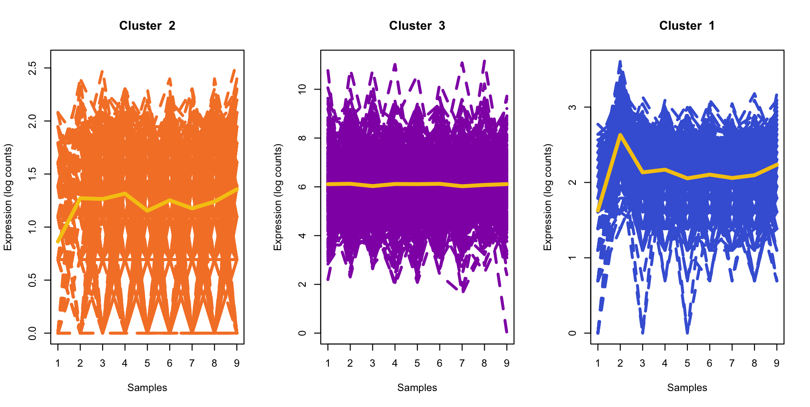
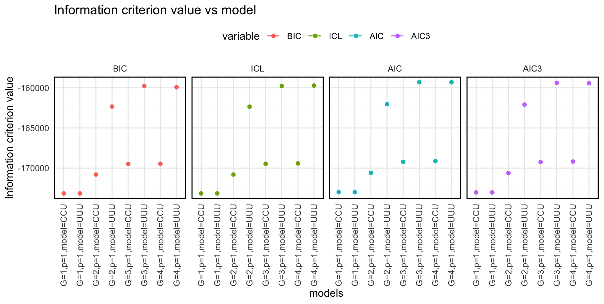

```{r setup, include=FALSE}
library(knitr)
opts_chunk$set(fig.align = "center", 
               out.width = "90%",
               fig.width = 6, fig.height = 5.5,
               dev.args=list(pointsize=10),
               par = TRUE, # needed for setting hook 
               collapse = TRUE, # collapse input & ouput code in chunks
               warning = FALSE)

knit_hooks$set(par = function(before, options, envir)
  { if(before && options$fig.show != "none") 
       par(family = "sans", mar=c(4.1,4.1,1.1,1.1), mgp=c(3,1,0), tcl=-0.5)
})
set.seed(1) # for exact reproducibility
```


## Introduction

[**mixMPLNFA**](https://github.com/anjalisilva/mixMPLNFA) is an R package for model-based clustering based on parsimonious mixtures of multivariate Poisson-log normal factor analyzers family (MPLNFA) via variational Gaussian approximations. It is applicable for clustering of count data. The [**mixMPLNFA**](https://github.com/anjalisilva/mixMPLNFA) package provides functions for parameter estimation via variational Gaussian approximations (VGA). Here we will explore this method. 

### Family of Models ###

See cittion for all details. Constraints can be imposed on $\Lambda_g$ and $\Psi_g$ results in a family of 8 models:

<div style="text-align:center">
<div style="text-align:left">

<br>

<div style="text-align:left">

### Parameter Estimation via VGA

[Subedi and Browne (2020)](https://doi.org/10.1002/sta4.310) had proposed a framework for parameter estimation utilizing variational Gaussian approximation (VGA) for mixtures of multivariate Poisson- log normal distribution-based mixture models. Markov chain Monte Carlo expectation-maximization (MCMC-EM) has also been used for parameter estimation of MPLN-based mixture models, but VGA was shown to be computationally efficient (Silva et al., 2023). This method is employed in the function *MPLNFAClust*. Variational approximations (Wainwright et al., 2008) are approximate inference techniques in which a computationally convenient approximating density is used in place of a more complex but 'true' posterior density. The approximating density is obtained by minimizing the Kullback-Leibler (KL) divergence between the true and the approximating densities. The VGAs approach is computationally efficient, however, it does not guarantee an exact posterior (Ghahramani and Beal, 1999). 

### Model Selection
Four model selection criteria are offered, which include the Akaike information criterion (AIC; Akaike, 1973), the Bayesian information criterion (BIC; Schwarz, 1978), a variation of the AIC used by Bozdogan (1994) called AIC3, and the integrated completed likelihood (ICL; Biernacki et al., 2000). 

### Other Information
Starting values (argument: initMethod) can play an important role to the successful operation of this algorithm. There maybe issues with singularity, in which case altering starting values via initialization method may help.

This document was written in R Markdown, using the **knitr** package for production. See `help(package = "mixMPLNFA")` for further details and references provided by `citation("mixMPLNFA")`. To download [**mixMPLNFA**](https://github.com/anjalisilva/mixMPLNFA), use the following commands:

``` r
require("devtools")
devtools::install_github("anjalisilva/mixMPLNFA", build_vignettes = TRUE)
library("mixMPLNFA")
```

<br>
<div style="text-align:left">

## Data Simulation

Currently, no function is available to simulate data from the model of [**mixMPLNFA**](https://github.com/anjalisilva/mixMPLNFA). You may use function *MPLNClust::mplnDataGenerator()* from [**MPLNClust**] package which permits to simulate data from a mixture of MPLN distributions. See *?MPLNClust::mplnDataGenerator* for more information, an example, and references. To simulate a dataset from a mixture of MPLN with 2000 observations, 9 dimensions, with three mixture components, each with a mixing proportion of 0.79 and 0.21, respectively, let us use *mixMVPLN::mvplnDataGenerator()*. Here **clusterGeneration** R package is used to generate positive definite covariance matrices for illustration purposes. 

``` r
set.seed(1234) # for reproducibility, setting seed
# Here, Lambda (loading matrix) is unconstrained and Psi
(error variance and isotropic) are all unconstrained and
hence UUU model is used

numDatasets <- 1 # total number of datasets to be generated
pfactors <- 4 # number of true latent factors
dimensionality <- 10 # dimensionality of observed data
trueClusters <- 3 # number of groups/clusters
mixingProportions <- c(0.23, 0.44, 0.33) # mixing proportions for 4 clusters
nObservations <- 1000 # sample size or number of observations

# set parameter values
mu <- list(c(4, 6, 4, 2, 2, 4, 6, 4, 6, 2),
           c(5, 5, 3, 3, 7, 5, 3, 3, 7, 7),
           c(2, 4, 4, 7, 2, 4, 7, 2, 7, 4))

Lambda <- list(matrix(runif(pfactors * dimensionality, -1, 1), 
               nrow = dimensionality),
               matrix(runif(pfactors * dimensionality, -1, 1), 
               nrow = dimensionality),
               matrix(runif(pfactors * dimensionality, -1, 1), 
               nrow = dimensionality))

Psi <- list(diag(dimensionality) * runif(dimensionality),
            diag(dimensionality) * runif(dimensionality),
            diag(dimensionality) * runif(dimensionality))

# generate a UUU dataset
simDataUUU <- mixMPLNFA::mplnFADataGenerator(numDatasets = numDatasets,
                                  nObservations = nObservations,
                                  dimensionality = dimensionality,
                                  mixingProportions = mixingProportions,
                                  trueClusters = trueClusters,
                                  pfactors = pfactors,
                                  modelName = "UUU",
                                  mu = mu,
                                  Lambda = Lambda,
                                  Psi = Psi)

```
<br>

The generated dataset can be checked:

``` r
nrow(simDataUUU$`dataset=1`$dataset) # 1000 observations
ncol(simDataUUU$`dataset=1`$dataset) # 10 dimensions
class(simDataUUU$`dataset=1`$dataset) # matrix 
summary(simDataUUU$`dataset=1`$dataset) # summary of data
dim(simDataUUU$`dataset=1`$dataset) # 1000 x 10
```

<br>

<div style="text-align:left">

## Clustering
<div style="text-align:left">
Once the count data is available, clustering can be performed using the *mixMPLNFA::MPLNFAClust* function. See *?mixMPLNFA::MPLNFAClust* for more information, including examples and references. Here, clustering will be performed using the above generated dataset. 

Below, clustering of *simDataUUU$`dataset=1`$dataset* is performed for g = 1:3 with latent factors from p = 1:3 with model tested including CCU and UUU. 

``` r
# Clustering
MPLNFAEx <- mixMPLNFA::MPLNFAClust(
                     dataset = simDataUUU$`dataset=1`$dataset,
                     membership = simDataUUU$`dataset=1`$trueMembership,
                     gmin = 1,
                     gmax = 2,
                     pmin = 1,
                     pmax = 3,
                     modelNames = c("UUU", "UUC", "UCU", "UCC",
                     "CUU", "CUC", "CCU", "CCC"),
                     normalize = "No")

names(MPLNFAEx) # see all names of outputs

# To see BIC results
MPLNFAEx$BICresults
MPLNFAEx$BICresults$BICmodelselected # "G=3, p=4, UUU"


# To see output saved                      
names(MPLNFAEx) 
# [1] "dataset"              "dimensionality"       "normalizationFactors"
# [4] "gmin"                 "gmax"                 "pmin"                
# [7] "pmax"                 "modelNames"           "initalizationMethod" 
# [10] "allResults"           "logLikelihood"        "numbParameters"      
# [13] "trueLabels"           "ICLresults"           "BICresults"          
# [16] "AICresults"           "AIC3results"          "totalTime"       

# To see total time
MPLNFAEx$totalTime
#    user  system elapsed 
# 306.731   4.535 312.929 
                      
```

The model selected by BIC for this dataset can be further analyzed.

``` r
MPLNFAEx$BICresults$BICmodelselected
# G=3,p=1,model=UUU selected
# A model with 3 components/clusters is selected

# Cross tabulation of BIC selected model labels with true lables
table(MPLNFAEx$BICresults$BICmodelSelectedLabels, 
      simDataUUU$`dataset=1`$trueMembership)
#     1    2    3
#1    0    0 1000
#2    0  594    0
#3  406    0    0
```

## Visualize Results

Clustering results can be viewed as a barplot of probabilities. For this, select a model of interest and use *mixMPLNFA::mplnFAVisLine()* function from `mixMPLNFA` R package. 

``` r
#  Visualizing probabilities for 2 components 
par(mfrow = c(1, 3))                    
MPLNLineColor <- mixMPLNFA::mplnFAVisLine(
                    dataset = simDataUUU$`dataset=1`$dataset,
                    clusterMembershipVector = MPLNFAEx$BICresults$BICmodelSelectedLabels,
                    fileName = 'multiColorPlot',
                    LinePlotColours = "multicolour",
                    printPlot = FALSE)
```



<div style="text-align:left">

The above plot illustrates, for each cluster, its expression pattern with counts being log-transformed. The average expression of each cluster is shown in yellow.

<br>

Log-likelihood and information criteria value at each run can be plotted as follows.
``` r
# install.packages("ggplot2")
# library("ggplot2")
# library("tidyverse")
# library("reshape")

# Log-likelihood
# MPLNFAResults$logLikelihood %>%
#   data.frame() %>%
#   dplyr::rename(logL = ".") %>%
#   tibble::rownames_to_column('models') %>%
#   data.frame() %>%
#   ggplot2::ggplot(mapping = aes(x = models, y = logL, group=1)) +
#   geom_line(linetype = "dashed") +
#   geom_point() +
#   ggtitle("Final logL of each model") +
#   theme_minimal() +
#   theme(legend.position = "top",
#         axis.text.x = element_text(angle = 90, vjust = 0.5, hjust = 1),
#         panel.border = element_rect(colour = "black", fill = NA, linewidth = 1))

# Information criteria value at each run               
# ICvalues <- data.frame(
#               BIC = MPLNFAResults$BICresults$allBICvalues,   
#               ICL = MPLNFAResults$ICLresults$allICLvalues,
#               AIC = MPLNFAResults$AICresults$allAICvalues,
#               AIC3= MPLNFAResults$AIC3results$allAIC3values)
              
# ICvalues %>%
#   tibble::rownames_to_column('models') %>%
#   reshape::melt() %>%
#   ggplot2::ggplot(mapping = aes(x = models, y = value, col=variable)) +
#   geom_line(linetype = "dashed") +
#   geom_point() +
#   ggtitle("Information criterion value vs model") +
#   ylab("Information criterion value") +
#   theme_minimal() +
#   theme(legend.position = "top",
#         axis.text.x = element_text(angle = 90, vjust = 0.5, hjust = 1),
#         panel.border = element_rect(colour = "black", fill = NA, linewidth = 1)) +
#         facet_grid(cols = vars(variable))

```



<br>

<div style="text-align:left">

## References

- [Aitchison, J. and C. H. Ho (1989). The multivariate Poisson-log normal distribution. *Biometrika.*](https://www.jstor.org/stable/2336624?seq=1)

- [Akaike, H. (1973). Information theory and an extension of the maximum likelihood principle. In *Second International Symposium on Information Theory*, New York, NY, USA, pp. 267–281. Springer Verlag.](https://link.springer.com/chapter/10.1007/978-1-4612-1694-0_15)

- [Biernacki, C., G. Celeux, and G. Govaert (2000). Assessing a mixture model for clustering with the integrated classification likelihood. *IEEE Transactions on Pattern Analysis and Machine Intelligence* 22.](https://hal.inria.fr/inria-00073163/document)

- [Bouveyron, C. and C. Brunet (2014). Model-based clustering of high-dimensional data: A review. *Computational Statistics and Data Analysis.* 71, 52–78.](https://www.sciencedirect.com/science/article/abs/pii/S0167947312004422)


- [Bozdogan, H. (1994). Mixture-model cluster analysis using model selection criteria and a new informational measure of complexity. In *Proceedings of the First US/Japan Conference on the Frontiers of Statistical Modeling: An Informational Approach: Volume 2 Multivariate Statistical Modeling*, pp. 69–113. Dordrecht: Springer Netherlands.](https://link.springer.com/chapter/10.1007/978-94-011-0800-3_3)

- [Ghahramani, Z. and Beal, M. (1999). Variational inference for bayesian mixtures of factor analysers. *Advances in neural information processing systems* 12.](https://cse.buffalo.edu/faculty/mbeal/papers/nips99.pdf)

- [McNicholas, P. D., and T. B. Murphy (2008). Parsimonious Gaussian mixture models. *Statistics and Computing.* 18, 285–296.](https://link.springer.com/article/10.1007/s11222-008-9056-0)

- [Robinson, M.D., and Oshlack, A. (2010). A scaling normalization method for differential expression analysis of RNA-seq data. *Genome Biology* 11, R25.](https://genomebiology.biomedcentral.com/articles/10.1186/gb-2010-11-3-r25)

- [Schwarz, G. (1978). Estimating the dimension of a model. *The Annals of Statistics* 6.](https://www.jstor.org/stable/2958889?seq=1)

- [Silva, A., S. J. Rothstein, P. D. McNicholas, and S. Subedi (2019). A multivariate Poisson-log normal mixture model for clustering transcriptome sequencing data. *BMC Bioinformatics.*](https://pubmed.ncbi.nlm.nih.gov/31311497/)

- [Subedi, S., R.P. Browne (2020). A family of parsimonious mixtures of
  multivariate Poisson-lognormal distributions for clustering
  multivariate count data. *Stat.* 9:e310.](https://doi.org/10.1002/sta4.310)


----

```{r}
sessionInfo()
```


