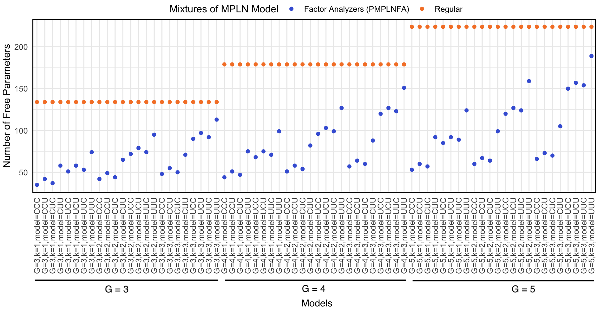

```{r setup, include=FALSE}
library(knitr)
opts_chunk$set(fig.align = "center", 
               out.width = "90%",
               fig.width = 6, fig.height = 5.5,
               dev.args=list(pointsize=10),
               par = TRUE, # needed for setting hook 
               collapse = TRUE, # collapse input & ouput code in chunks
               warning = FALSE)

knit_hooks$set(par = function(before, options, envir)
  { if(before && options$fig.show != "none") 
       par(family = "sans", mar=c(4.1,4.1,1.1,1.1), mgp=c(3,1,0), tcl=-0.5)
})
set.seed(1) # for exact reproducibility
```


## Introduction

[**mixMPLNFA**](https://github.com/anjalisilva/mixMPLNFA) is an R package for model-based clustering based on parsimonious mixtures of multivariate Poisson-log normal factor analyzers family (MPLNFA) via variational Gaussian approximations. The model is applicable for clustering of count data and by considering a factor analyzer structure, it reduces the number of free covariance structure parameters to be calculated. The [**mixMPLNFA**](https://github.com/anjalisilva/mixMPLNFA) package provides functions for parameter estimation via variational Gaussian approximations (VGA). Below we will explore this method. 

### Family of Models ###

Subspace clustering allows to cluster data in low-dimensional subspaces, while keeping all the dimensions and by introducing restrictions to mixture parameters ([Bouveyron and Brunet, 2014](https://www.sciencedirect.com/science/article/abs/pii/S0167947312004422)). Restrictions are introduced to the model parameters with the aim of obtaining parsimonious models, which are sufficiently flexible for clustering purposes. Since the largest contribution of free parameters is through the covariance matrices, it is a natural focus for the introduction of parsimony.

The factor analysis model was introduced by Spearman (1904) and is useful in modeling the covariance structure of high-dimensional data using a small number of latent variables. The mixture of factor analyzers model was later introduced  by Ghahramani et al., 1996, and this model is able to concurrently perform clustering and, within each cluster, local dimensionality reduction. In 2008, a family of eight parsimonious Gaussian mixture models (PGMMs; [McNicholas and Murphy, 2008](https://link.springer.com/article/10.1007/s11222-008-9056-0)) were introduced with parsimonious covariance structures. In 2019, a model-based clustering methodology using mixtures of multivariate
Poisson-log normal distribution (MPLN; [Aitchison and Ho, 1989](mixMPLNFA)) was developed to analyze multivariate count measurements by [Silva et al., 2019](https://pubmed.ncbi.nlm.nih.gov/31311497/). 

In this model, a family of mixtures of MPLN factor analyzers that is analogous to the PGMM family is utilized, by considering the general mixture of factor analyzers model ($\mathbf{\Sigma}_g$ = $\mathbf{\Lambda}_g$ $\mathbf{\Lambda}_g^{\prime}$ + $\mathbf{\Psi}_g $) and by allowing the constraints $\mathbf{\Lambda}_g = \mathbf{\Lambda}$, $\mathbf{\Psi}_g = \mathbf{\Psi}$, and the isotropic constraint $\mathbf{\Psi}_g = \psi_{g}\mathbf{I}_d$. This new family is referred to as the parsimonious mixtures of MPLN factor analyzers family (MPLNFA). The proposed model simultaneously performs factor analysis and cluster analysis, by assuming that the discrete observed data have been generated by a factor analyzer model with continuous latent variables.

The MPLNFA family of 8 models:

<div style="text-align:center">
<div style="text-align:left">

<br>

<div style="text-align:left">

### Parameter Estimation via VGA

[Subedi and Browne (2020)](https://doi.org/10.1002/sta4.310) had proposed a framework for parameter estimation utilizing variational Gaussian approximation (VGA) for mixtures of multivariate Poisson- log normal distribution-based mixture models. Markov chain Monte Carlo expectation-maximization (MCMC-EM) has also been used for parameter estimation of MPLN-based mixture models, but VGA was shown to be computationally efficient (Silva et al., 2023). This method is employed in the function *MPLNFAClust*. Variational approximations (Wainwright et al., 2008) are approximate inference techniques in which a computationally convenient approximating density is used in place of a more complex but 'true' posterior density. The approximating density is obtained by minimizing the Kullback-Leibler (KL) divergence between the true and the approximating densities. The VGAs approach is computationally efficient, however, it does not guarantee an exact posterior (Ghahramani and Beal, 1999). 

### Model Selection
Four model selection criteria are offered, which include the Akaike information criterion (AIC; Akaike, 1973), the Bayesian information criterion (BIC; Schwarz, 1978), a variation of the AIC used by Bozdogan (1994) called AIC3, and the integrated completed likelihood (ICL; Biernacki et al., 2000). 

### Other Information
Starting values (argument: initMethod) can play an important role to the successful operation of this algorithm. There maybe issues with singularity, in which case altering starting values via initialization method may help.

This document was written in R Markdown, using the **knitr** package for production. See `help(package = "mixMPLNFA")` for further details and references provided by `citation("mixMPLNFA")`. To download [**mixMPLNFA**](https://github.com/anjalisilva/mixMPLNFA), use the following commands:

``` r
require("devtools")
devtools::install_github("anjalisilva/mixMPLNFA", build_vignettes = TRUE)
library("mixMPLNFA")
```

<br>
<div style="text-align:left">

## Data Simulation

To simulate a dataset from MPLNFA with 1000 observations (n), 8 dimensions (d), two latent factors (k), with four mixture components (g), each with a mixing proportion (pi) of 0.11, 0.43, 0.24 and 0.22, respectively, and the UCC covariance structure. Let us use *mixMPLNFA::mplnFADataGenerator()*. 

``` r
?mixMPLNFA::mplnFADataGenerator # to read more about this function

# Example 1: Cluster a UCC datset
# Here, Lambda (loading matrix) is unconstrained and Psi
# (error variance and isotropic) are all constrained and
# hence UCC model is used

set.seed(1234) # for reproducibility, setting seed
kfactors <- 2 # number of true latent factors
dimensionality <- 8 # dimensionality of observed data
trueClusters <- 4 # number of groups/clusters
mixingProportions <- c(0.11, 0.43, 0.24, 0.22) # mixing proportions for 4 clusters
nObservations <- 1000 # sample size or number of observations

# set parameter values
mu <- list(c(6, 3, 3, 6, 3, 6, 3, 3),
           c(5, 3, 5, 3, 5, 3, 3, 5),
           c(4, 2, 6, 4, 2, 6, 4, 4),
           c(1, 3, 5, 1, 3, 5, 3, 5))

Lambda <- list(matrix(runif(kfactors * dimensionality, -1, 1), nrow = dimensionality),
               matrix(runif(kfactors * dimensionality, -1, 1), nrow = dimensionality),
               matrix(runif(kfactors * dimensionality, -1, 1), nrow = dimensionality),
               matrix(runif(kfactors * dimensionality, -1, 1), nrow = dimensionality))

Psi <- list(diag(dimensionality) * runif(1),
            diag(dimensionality) * runif(1),
            diag(dimensionality) * runif(1),
            diag(dimensionality) * runif(1))

# generate dataset
simDataUCC <- mixMPLNFA::mplnFADataGenerator(
                         numDatasets = 1,
                         nObservations = nObservations,
                         dimensionality = dimensionality,
                         mixingProportions = mixingProportions,
                         trueClusters = trueClusters,
                         kfactors = kfactors,
                         modelName = "UCC",
                         mu = mu,
                         Lambda = Lambda,
                         Psi = Psi)


```
<br>

The generated dataset can be checked:

``` r
nrow(simDataUCC$`dataset=1`$dataset) # 1000 observations
ncol(simDataUCC$`dataset=1`$dataset) # 8 dimensions
class(simDataUCC$`dataset=1`$dataset) # matrix 
summary(simDataUCC$`dataset=1`$dataset) # summary of data
dim(simDataUCC$`dataset=1`$dataset) # 1000 x 8
table(simDataUCC$`dataset=1`$trueMembership) # true membership
#  1   2   3   4 
# 114 466 223 197
```

<br>

<div style="text-align:left">

## Clustering
<div style="text-align:left">
Once the count data is available, clustering can be performed using the *mixMPLNFA::MPLNFAClust* function. See *?mixMPLNFA::MPLNFAClust* for more information, including examples and references. Here, clustering will be performed using the above generated dataset.  

Below, clustering of *simDataUCC$`dataset=1`$dataset* is performed for g = 3:5 clusters, with latent factors from k = 1:3, with model tested for all c("UUU", "UUC", "UCU", "UCC", "CUU", "CUC", "CCU", "CCC"). This function simultaneously performs factor analysis and cluster analysis, by assuming that the discrete observed data (counts) have been generated by a factor analyzer model with continuous latent variables.

``` r

# Clustering
MPLNFAEx1 <- mixMPLNFA::MPLNFAClust(
  dataset = simDataUCC$`dataset=1`$dataset,
  membership = simDataUCC$`dataset=1`$trueMembership,
  gmin = 3,
  gmax = 5,
  kmin = 1,
  kmax = 3,
  modelNames = c("UUU", "UUC", "UCU", "UCC",
                 "CUU", "CUC", "CCU", "CCC"),
  normalize = "Yes")
  
# To see output saved                      
names(MPLNFAEx1) 
# [1] "dataset"              "dimensionality"       "normalizationFactors"
# [4] "gmin"                 "gmax"                 "kmin"                
# [7] "kmax"                 "modelNames"           "initalizationMethod" 
# [10] "allResults"           "logLikelihood"        "numbParameters"      
# [13] "trueLabels"           "ICLresults"           "BICresults"          
# [16] "AICresults"           "AIC3results"          "totalTime"          

# To see total time
MPLNFAEx1$totalTime
#    user  system elapsed 
# 1589.256   18.665 1614.664 
                      
```

The model selected by BIC for this dataset can be further analyzed.

``` r
# To see BIC results
MPLNFAEx1$BICresults
MPLNFAEx1$BICresults$BICmodelselected # "G=4,p=2,model=UUC"

# Compare with true labels
table(MPLNFAEx1$BICresults$BICmodelSelectedLabels,
      simDataUCC$`dataset=1`$trueMembership)
 #     1   2   3   4
 # 1   0   0   1 197
 # 2   0   0 222   0
 # 3   0 466   0   0
 # 4 114   0   0   0


# Access all results for g = 4, p = 2, model = "UCC"
# UCC is mentioned in fourth place for input string of modelNames argument
MPLNFAEx1$allResults[[2]][[2]][[4]]
```

## Visualize Results

Clustering results can be viewed as a barplot of probabilities. For this, select a model of interest and use *mixMPLNFA::mplnFAVisLine()* function from `mixMPLNFA` R package. 

``` r
#  Visualizing expression patterns for 4 components 
par(mfrow = c(2, 2))                    
MPLNLineColor <- mixMPLNFA::mplnFAVisLine(
                    dataset = simDataUCC$`dataset=1`$dataset,
                    clusterMembershipVector = MPLNFAEx1$BICresults$BICmodelSelectedLabels,
                    fileName = 'multiColorPlot',
                    LinePlotColours = "multicolour",
                    printPlot = FALSE)
```


<div style="text-align:left">

The above plot illustrates, for each cluster, its expression pattern with counts being log-transformed. The average expression of each cluster is shown in yellow.

<br>

Log-likelihood and information criteria value at each run can be plotted as follows.
``` r
# install.packages(c("ggplot2", "tidyverse", "reshape"))
library("ggplot2")
library("tidyverse")
library("reshape")

# Log-likelihood
MPLNFAEx1$logLikelihood %>%
   data.frame() %>%
   dplyr::rename(logL = ".") %>%
   tibble::rownames_to_column('models') %>%
   data.frame() %>%
   ggplot2::ggplot(mapping = aes(x = models, y = logL, group=1)) +
   geom_line(linetype = "dashed") +
   geom_point() +
   ggtitle("Final logL of each model") +
   theme_minimal() +
   theme(legend.position = "top",
         axis.text.x = element_text(angle = 90, vjust = 0.5, hjust = 1),
         panel.border = element_rect(colour = "black", fill = NA, linewidth = 1))
```         
         
         
<br>

``` r
# Information criteria value at each run               
 ICvalues <- data.frame(
               BIC = MPLNFAEx1$BICresults$allBICvalues,   
               ICL = MPLNFAEx1$ICLresults$allICLvalues,
               AIC = MPLNFAEx1$AICresults$allAICvalues,
               AIC3 = MPLNFAEx1$AIC3results$allAIC3values)

# Plot BIC              
 ICvalues %>%
   tibble::rownames_to_column('models') %>%   
   dplyr::select("models", "BIC") %>% # select for BIC
   reshape::melt() %>%
   ggplot2::ggplot(mapping = aes(x = models, y = value, col=variable)) +
   geom_line(linetype = "dashed") +
   geom_point() +
   ggtitle("Information criterion value vs model") +
   ylab("Information criterion value") +
   theme_minimal() +
   theme(legend.position = "top",
         axis.text.x = element_text(angle = 90, vjust = 0.5, hjust = 1),
         panel.border = element_rect(colour = "black", fill = NA, linewidth = 1)) +
         facet_grid(cols = vars(variable))

# ICL
 ICvalues %>%
   tibble::rownames_to_column('models') %>%   
   dplyr::select("models", "ICL") %>% # select for ICL
   reshape::melt() %>%
   ggplot2::ggplot(mapping = aes(x = models, y = value, col=variable)) +
   geom_line(linetype = "dashed") +
   geom_point() +
   ggtitle("Information criterion value vs model") +
   ylab("Information criterion value") +
   theme_minimal() +
   theme(legend.position = "top",
         axis.text.x = element_text(angle = 90, vjust = 0.5, hjust = 1),
         panel.border = element_rect(colour = "black", fill = NA, linewidth = 1)) +
         facet_grid(cols = vars(variable))

```


<br>

<div style="text-align:left">
<br>
<br>

Let's explore the benefit of using factor analysis model. The proposed models of MPLNFA are well-suited to high-dimensional applications as the number of free parameters is linear in data dimensionality for all eight models, as opposed to in traditional mixtures of MPLN model, where the parameters grow quadratically. 

``` r
library(RColorBrewer)

paraTable <- data.frame(
  FactorAnalyser = MPLNFAEx1$numbParameters,
  Regular= MPLNFAEx1$nParametersRegular)


paraTable %>%
   tibble::rownames_to_column('models') %>%   
   reshape::melt() %>%
   ggplot2::ggplot(mapping = aes(x = models, 
                                 y = value, 
                                 col = variable)) +
   ggplot2::geom_point() +
   ggplot2::scale_color_manual(
        labels = c('Factor Analyzers (PMPLNFA)', 'Regular'), 
        values = c('#4363d8', '#f58231')) +
   guides(color = guide_legend(title = "Mixtures of MPLN Model")) +
   ggplot2::ylab("Number of Free Parameters") +
   ggplot2::theme_minimal() +
   ggplot2::theme(legend.position = "top",
         axis.text.x = 
         element_text(angle = 90, vjust = 0.5, hjust = 1),
         panel.border = 
         element_rect(colour = "black", fill = NA, linewidth = 1))

```

<br>

<div style="text-align:left">

This figure illustrates the number of free parameters that would need be calculated if a regular mixtures of MPLN model was to be used, represented in blue color. For the same model, the number of free parameters in the factor analyzer framework is also shown in orange color. Note the difference in the number of parameters for the same 'G' or cluster size/component. 

## References

- [Aitchison, J. and C. H. Ho (1989). The multivariate Poisson-log normal distribution. *Biometrika.*](https://www.jstor.org/stable/2336624?seq=1)

- [Akaike, H. (1973). Information theory and an extension of the maximum likelihood principle. In *Second International Symposium on Information Theory*, New York, NY, USA, pp. 267–281. Springer Verlag.](https://link.springer.com/chapter/10.1007/978-1-4612-1694-0_15)

- [Biernacki, C., G. Celeux, and G. Govaert (2000). Assessing a mixture model for clustering with the integrated classification likelihood. *IEEE Transactions on Pattern Analysis and Machine Intelligence* 22.](https://hal.inria.fr/inria-00073163/document)

- [Bouveyron, C. and C. Brunet (2014). Model-based clustering of high-dimensional data: A review. *Computational Statistics and Data Analysis.* 71, 52–78.](https://www.sciencedirect.com/science/article/abs/pii/S0167947312004422)

- [Bozdogan, H. (1994). Mixture-model cluster analysis using model selection criteria and a new informational measure of complexity. In *Proceedings of the First US/Japan Conference on the Frontiers of Statistical Modeling: An Informational Approach: Volume 2 Multivariate Statistical Modeling*, pp. 69–113. Dordrecht: Springer Netherlands.](https://link.springer.com/chapter/10.1007/978-94-011-0800-3_3)

- Ghahramani, Z., G. E. Hinton, et al. (1996). The EM algorithm for mixtures of factor analyzers. Technical report, Technical Report CRG-TR-96-1, University of Toronto.

- [Ghahramani, Z. and Beal, M. (1999). Variational inference for bayesian mixtures of factor analysers. *Advances in neural information processing systems* 12.](https://cse.buffalo.edu/faculty/mbeal/papers/nips99.pdf)

- [McNicholas, P. D., and T. B. Murphy (2008). Parsimonious Gaussian mixture models. *Statistics and Computing.* 18, 285–296.](https://link.springer.com/article/10.1007/s11222-008-9056-0)

- [Robinson, M.D., and Oshlack, A. (2010). A scaling normalization method for differential expression analysis of RNA-seq data. *Genome Biology* 11, R25.](https://genomebiology.biomedcentral.com/articles/10.1186/gb-2010-11-3-r25)

- [Schwarz, G. (1978). Estimating the dimension of a model. *The Annals of Statistics* 6.](https://www.jstor.org/stable/2958889?seq=1)

- [Silva, A., S. J. Rothstein, P. D. McNicholas, and S. Subedi (2019). A multivariate Poisson-log normal mixture model for clustering transcriptome sequencing data. *BMC Bioinformatics.*](https://pubmed.ncbi.nlm.nih.gov/31311497/)

- Spearman, C. (1904). The proof and measurement of association between two things. *The American Journal of Psychology*, 15(1).

- [Subedi, S., R.P. Browne (2020). A family of parsimonious mixtures of multivariate Poisson-lognormal distributions for clustering multivariate count data. *Stat.* 9:e310.](https://doi.org/10.1002/sta4.310)


----

```{r}
sessionInfo()
```


